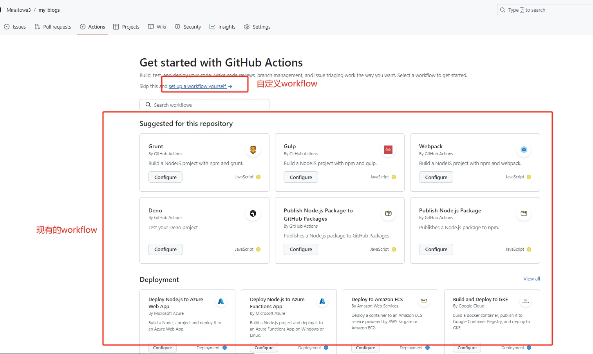
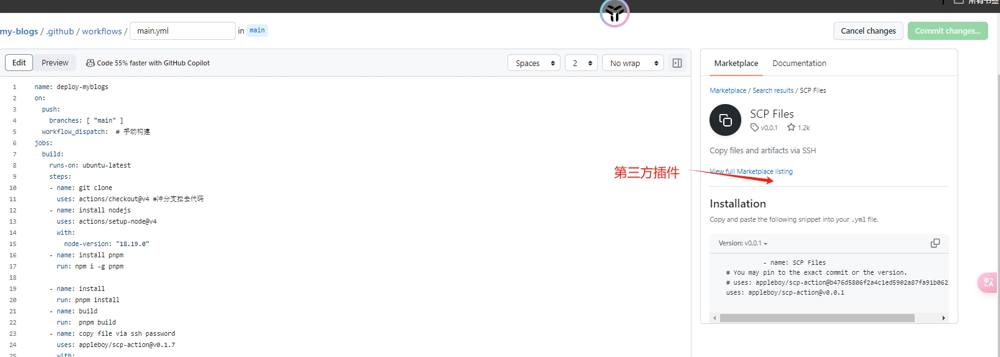
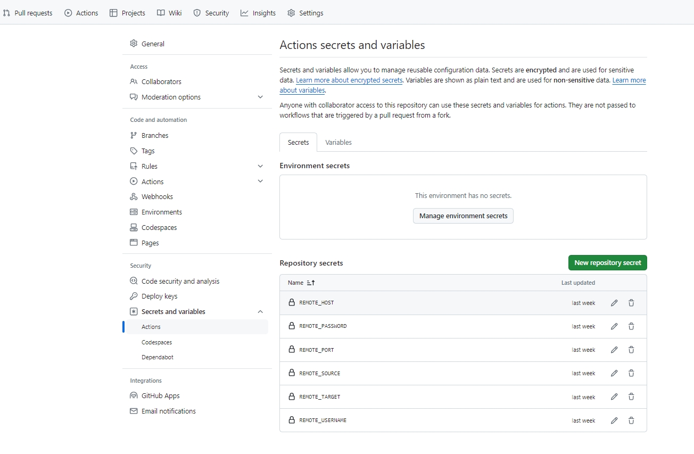
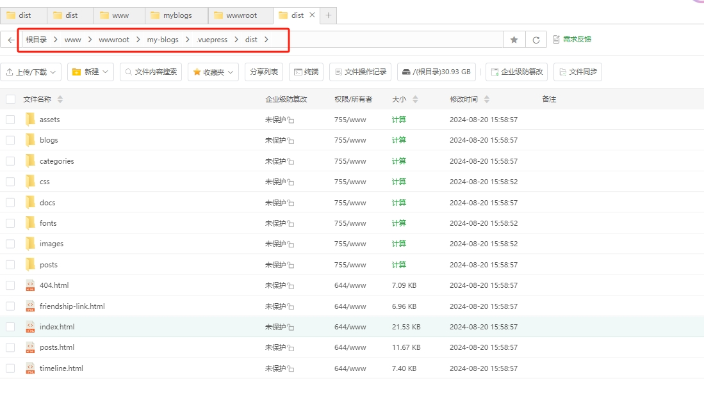
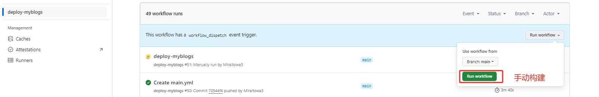
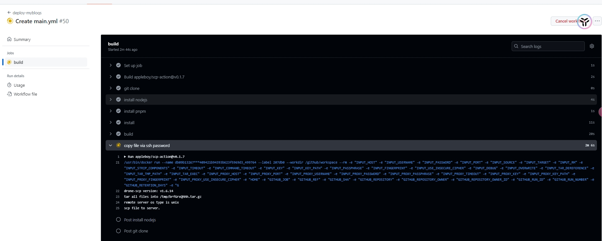
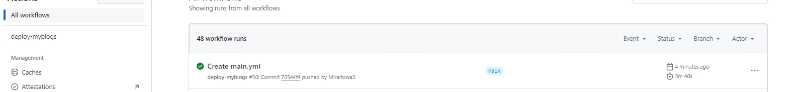

## 一、GitHub Actions

- `GitHub Actions` 是一种持续集成和持续交付 (CI/CD) 平台，可用于自动执行生成、测试和部署管道。 您可以创建工作流程来构建
  和测试存储库的每个拉取请求，或将合并的拉取请求部署到生产环境。

## 二、构建流程

- 开发人员把代码 push 到 github
- 触发 github 钩子（push）执行 github action 预定好的工作流
- 安装依赖，打包构建
- 通过 ssh 上传静态资源到服务器
- 可选性通知开发者

## 三、实现自动化部署

### 3.1 创建自定义 workflow



 * 在代码仓库中创建`.github/workflows/main.yml`文件

###  3.2 实现workflow
#### 3.2.1 指定工作流程的名称

```yml
# 指定工作流程的名称
name: deploy-myblogs

```
#### 3.2.2 指定此工作流程的触发事件Event
```yml
on:
  push:
    branches: ['main']
  workflow_dispatch: # 手动构建

```

#### 3.2.3 创建构建流程
```yml
jobs:
  build:
 # 指定该Job在最新版本的 Ubuntu Linux 的 Runner(运行器)上运行
    runs-on: ubuntu-latest
    # 存放 check-bats-version 作业中的所有Step
    steps:

```

#### 3.2.4拉取代码
```yml
  - name: git clone
    uses: actions/checkout@v4 #冲分支拉去代码

```
#### 3.2.5  安装nodejs
```yml
  - name: install nodejs
    uses: actions/setup-node@v4
    with:
      node-version: '18.19.0'

```
#### 3.2.6  安装pnpm、安装依赖、打包
```yml
    - name: install pnpm
      run: npm i -g pnpm
    - name: install
      run: pnpm install
    - name: build
      run: pnpm build

```
#### 3.2.6  部署到目标服务器

**这里使用第三方插件`SCP Files`**


```yml
  - name: copy file via ssh password
  - uses: appleboy/scp-action@v0.1.7
    with:
      #目标服务器地址
      host: '125.22.4.20'
      #用户名
      username: '用户名'
      #用户密码
      password: '用户密码'
      #ssh 端口
      port: '22'
      #代码打包后的路径
      source: '‘./.vuepress/dist/*'
      #把打包代码 放到服务器`/www/wwwroot/my-blogs/`这个路径下
      target: '/www/wwwroot/my-blogs/'
      # 删除服务器`/www/wwwroot/my-blogs/`这个路径下的旧代码
      rm: true

      strip_components: 2

```
#### 3.2.6. 目标服务器信息进行加密




* 代码如下：

```yml
  - name: copy file via ssh password
  - uses: appleboy/scp-action@v0.1.7
    with:
      #目标服务器地址
      host: ${{ secrets.REMOTE_HOST }}
      #用户名
      username: ${{secrets.REMOTE_USERNAME}}
      #用户密码
      password: '${{secrets.REMOTE_PASSWORD}}'
      #ssh 端口
      port: ${{secrets.REMOTE_PORT}}
      #代码打包后的路径
      source: ${{ secrets.REMOTE_SOURCE }}
      #把打包代码 放到服务器`/www/wwwroot/my-blogs/`这个路径下
      target: ${{ secrets.REMOTE_TARGET }}
      # 删除服务器`/www/wwwroot/my-blogs/`这个路径下的旧代码
      rm: true

      strip_components: 2

```
:::info
```yml
 source: '‘./.vuepress/dist/*'
 target: '/www/wwwroot/my-blogs/'
```
在没有 strip_components的情况下，目标服务器 `/www/wwwroot/my-blogs/`这个目录下会多出`.vuepress/dist/`这两层目录


解决：设置 `strip_components`属性
:::


* workflow详完整如下：
```yml
# 指定工作流程的名称
name: deploy-myblogs
# 指定此工作流程的触发事件Event。 此示例使用 推送 事件，即执行push后，触发该流水线的执行
on:
  push:
    branches: ['main']
  workflow_dispatch: # 手动构建
# 存放 learn-github-actions 工作流程中的所有Job
jobs:
  build:
 # 指定该Job在最新版本的 Ubuntu Linux 的 Runner(运行器)上运行
    runs-on: ubuntu-latest
    # 存放 check-bats-version 作业中的所有Step
    steps:
      # step-no.1: 运行actions/checkout@v4操作，操作一般用uses来调用，
      # 一般用于处理一些复杂又频繁的操作例如拉取分支，安装插件
      # 此处 actions/checkout 操作是从仓库拉取代码到Runner里的操作
      # actions/开头的插件 ，是github action提供的
      - name: git clone
        uses: actions/checkout@v4 #冲分支拉去代码
      # step-no.2: actions/setup-node@v4 操作来安装指定版本的 Node.js，此处指定安装的版本为v18.19.0
      - name: install nodejs
        uses: actions/setup-node@v4
        with:
          node-version: '18.19.0'

      - name: install pnpm
        run: npm i -g pnpm
      - name: install
        run: pnpm install
      - name: build
        run: pnpm build
      # 部署到目标服务器
      # appleboy/scp-action@v0.1.7  是第三方插件
      #
      - name: copy file via ssh password
        uses: appleboy/scp-action@v0.1.7
        with:
          host: ${{ secrets.REMOTE_HOST }}
          username: ${{secrets.REMOTE_USERNAME}}
          password: ${{secrets.REMOTE_PASSWORD}}
          port: ${{secrets.REMOTE_PORT}}
          source: ${{ secrets.REMOTE_SOURCE }}
          target: ${{ secrets.REMOTE_TARGET }}
          rm: true
          strip_components: 2
```

### 3.3 构建部署

**方式一：手动构建**

 - 点击 `Run workflow` 开始构建


 - 构建中

   - 构建成功


**方式一：push构建**

- `git push`代码到github远程仓库，触发构建流程


参考链接：
-  [https://juejin.cn/post/7113562222852309023](https://juejin.cn/post/7113562222852309023)

-  [https://www.ruanyifeng.com/blog/2019/09/getting-started-with-github-actions.html](https://www.ruanyifeng.com/blog/2019/09/getting-started-with-github-actions.html)
