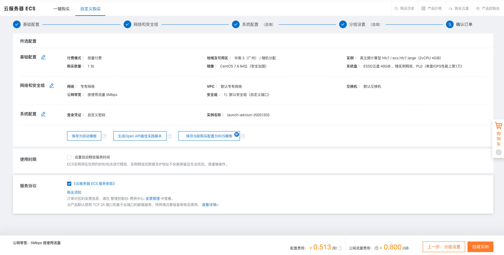
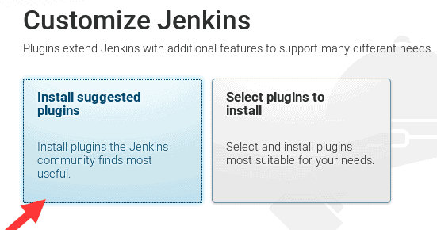

# 项目打包和自动化部署

## 一. 项目部署和DevOps

### 1.1. 传统的开发模式

在传统的开发模式中，开发的整个过程是按部就班就行：


但是这种模式存在很大的弊端：

* 工作的不协调：开发人员在开发阶段，测试和运维人员其实是处于等待的状态。等到测试阶段，开发人员等待测试反馈bug，也会处于等待状态。
* 线上bug的隐患：项目准备交付时，突然出现了bug，所有人员需要加班、等待问题的处理；


### 1.2. DevOps开发模式

DevOps是Development和Operations两个词的结合，将开发和运维结合起来的模式：


### 1.3. 持续集成和持续交付

伴随着DevOps一起出现的两个词就是持续集成和持续交付(部署)：

* CI是Continuous Integration（持续集成）；
* CD是两种翻译：Continuous Delivery（持续交付）或Continuous Deployment（持续部署）；

持续集成CI：


持续交付和持续部署：


### 1.4. 自动化部署流程


## 二. 购买云服务器

### 2.1. 注册阿里云的账号

云服务器我们可以有很多的选择：阿里云、腾讯云、华为云。

* 目前在公司使用比较多的是阿里云；
* 我自己之前也一直使用阿里云，也在使用腾讯云；
* 之前华为云也有找我帮忙推广他们的活动；

但是在我们的课程中，我选择目前使用更加广泛的阿里云来讲解：

我们需要注册阿里云账号

* https://aliyun.com/

* 注册即可，非常简单


### 2.2. 购买云服务器

购买云服务器

1.来到控制台：


2.创建实例，选择类型和配置


3.配置网络安全组


4.创建实例




::: warning
目前的最新版本为Node.js v18.x不支持Centos 7系统，因此安装支持Centos 7 的最高版本Nodejs v16.x。
<br/>
如果要使用>=Node.js18x,则需要安装centos8

:::

## 三. 搭建服务器环境

 * **java11**
 * **jenkins-2.471-1.1.noarch**
 * **centos7**

### 3.1. jenkins自动化部署

#### 3.1.1. 安装Java环境

Jenkins本身是依赖Java的，所以我们需要先安装Java环境：

* 安装Java

```shell
yum search java-11
yum install java-11-openjdk.x86_64
#或者
yum install java-11-openjdk*

java -version #查看jdk版本
```


#### 3.1.2. 安装Jenkins

因为Jenkins本身是没有在dnf的软件仓库包中的，所以我们需要连接Jenkins仓库：

* wget是Linux中下载文件的一个工具，-O表示输出到某个文件夹并且命名为什么文件；
* rpm：全称为**The RPM Package Manage**，是Linux下一个软件包管理器；

```shell
wget –O /etc/yum.repos.d/jenkins.repo http://pkg.jenkins-ci.org/redhat-stable/jenkins.repo

# 导入GPG密钥以确保您的软件合法
rpm --import https://pkg.jenkins.io/redhat/jenkins.io.key
# 或者
rpm --import http://pkg.jenkins-ci.org/redhat/jenkins-ci.org.key
```

编辑一下文件/etc/yum.repos.d/jenkins.repo

* 可以通过vim编辑

```
[jenkins]

name=Jenkins-stable

baseurl=http://pkg.jenkins.io/redhat

gpgcheck=1
```

安装Jenkins

:::: code-group
::: code-group-item war 包安装

```sh
#下载
wget https://mirrors.tuna.tsinghua.edu.cn/jenkins/war-stable/latest/jenkins.war #下载jenkins.war

#启动
java -jar jenkins.war --httpPort=8080 #启动jenkins
#启动成功后，通过`ip地址+端口`访问

#停止
ps -ef | grep jenkins

kill -9 进程号
```
:::
::: code-group-item yum 安装

```shell
#安装
yum install jenkins # --nogpgcheck(可以不加)

#启动Jenkins的服务
systemctl start jenkins #启动jenkins服务
systemctl stop jenkins #停止jenkins服务
systemctl enable jenkins #开机启动jenkins服务
systemctl daemon-reload #守护进程
```
::::

::: danger
 1. 
    **Job for jenkins.service failed because the control process exited with error code. See "systemctl status jenkins.service" and "journalctl -xe" for details.**

错误原因: java与jenkins的版本不匹配

解决：安装对应的版本，  jenkins 在这个范围内`2.x ~ 2.289.x` 需要 `java8` ，> `2.289.x`需要`java11`
 1. jenkins构建时错误：Job for jenkins.service failed becasused a timeout was exceeded ，错误如下
    

    排查过程：根据提示查看systemctl status jenkins和journalctl -xe
    
    根据systemctl status jenkins，可以看到jenkins服务一直处于启动中的状态

错误原因：发生此问题的原因是用户无权在目录/var/libs/jenkins上执行作业

解决方法：在jenkins配置文件中将将用户改为root，并重启
:::


**Jenkins默认使用8080端口提供服务，所以需要加入到安全组中：**


#### 3.1.3. 安装 git 仓库


```sh
yum install git
 git --version #查看git版本
```
#### 3.1.4. jenkins用户


**查看当前安装jenkins的安装报名**
 * 

**查看安装包的文件及路径**
 * 

**vim `/usr/lib/systemed/system/jenkins.service`,修改为 User=root**
 * 

**之后需要重启一下Jenkins：**

```shell
systemctl restart jenkins

```
#### 3.1.5. jenkins任务

**打开浏览器，输入：http://8.134.60.235:9000**

* 注意：你输入自己的IP地址

**获取输入管理员密码：**

* 在下面的地址中 `cat /var/lib/jenkins/secrets/initialAdminPassword`


**然后创建用户**

**可以安装推荐的插件：**

-


**创建任务**

点击 **新建 Item** 创建一个 `Freestyle Project`


在 **添加远程仓库** 处选择 git ，输入仓库地址，点击添加。


**添加凭证，与远程仓库建立关系**

输入 github 账号和密码，这里的密码有时候可能会出现问题，可以使用 `token` [github 如何生成 token ？](https://docs.github.com/cn/authentication/keeping-your-account-and-data-secure/creating-a-personal-access-token#creating-a-token "https://docs.github.com/cn/authentication/keeping-your-account-and-data-secure/creating-a-personal-access-token#creating-a-token")


**构建触发器**

* 修改 `Jenkins` 任务配置 构建触发器中选择 GitHub hook trigger for GITScm polling


* 来到 Jenkins 中选择 系统管理 -> 系统配置 找到 Jenkins URL 将其复制。
* 随后在尾部添加 github-webhook/ 尾部斜杠一定不要丢。 整体结构大致为 http://http://8.134.60.235:8080/github-webhook/
* 登录 github 需要集成的项目中添加 webhook。在 Payload URL 中将上述内容填入。


**构建环境安装**

* 安装nodejs插件


* 系统管理 -> 全局工具配置 中配置 Node (吐槽：没有安装任何插件时系统管理以及其子页面全是英文，安装完插件后又变成了中文。这国际化不知道是系统原因还是它的原因 😂)。


* 构建环境 ->选择 Provide Node & npm bin/ folder to PATH  ->选择nodejs版本


**部署到主机目标**
* 增加构建步骤 -> 执行 shell 输入打包发布相关的命令。Jenkins 会逐行执行。


::: danger
1. 由于项目构建时是在 Jenkins 的工作目录下执行脚本，会出现权限问题。导致即使使用了 sudo 还会出现类似以下错误,报错如下

```shell
We trust you have received the usual lecture from the local System
Administrator. It usually boils down to these three things:

    #1) Respect the privacy of others.
    #2) Think before you type.
    #3) With great power comes great responsibility.
```
 解决方案：在 /etc/sudoers 文件中增加 jenkins ALL=(ALL) NOPASSWD:ALL 表示在执行 sudo 时不需要输入密码。

2. 如果不使用 sudo 则会出现以下错误。

```shell
xxxxxxx: Permission denied
```
解决方案：修改 /lib/systemed/system/jenkins.service 文件。将 User=jenkins 修改为 User=root，表示给 Jenkins 赋权限。修改配置文件后记得重启服务。


3. 构建的过程中还可能出现以下错误

```shell
ERROR: Error fetching remote repo 'origin'
```
解决方案：由于需要构建的代码在 github 上面，这种错误表示拉取代码失败了，重试几次就可以了。
:::

::: info
 *jenkins-2.471-1.1.noarch+*
 jenkins安装目录：`/var/lib/jenkins/`
 <br/>
 jenkinsg工作目录：`/var/lib/jenkins/workspace/`


:::

### 3.2. 钉钉机器人通知（jenkins）

1，**系统管理 -> 插件管理** 搜索 `DingTalk` 进行安装。[文档](https://jenkinsci.github.io/dingtalk-plugin/ "https://jenkinsci.github.io/dingtalk-plugin/")


2，钉钉群创建机器人。**钉钉群 -> 只能群助手 -> 添加机器人 -> 自定义**


3，定义机器人名字和关键字，创建完成后先将 `webhook` 中的内容复制。


4，`Jenkins` 中 **系统管理 -> 系统配置 -> 钉钉 -> 新增** 配置完成后可点击右下角进行测试。


5，修改构建任务配置。


-   通知人：atAll 勾选后 `@` 不到准确的人。😂。输入框内可填写需要被 `@` 人的手机号，多个换行。

-   自定义内容：支持 `markdown` 写法，可以使用一些环境变量。

-   [实现默认 `@` 执行人](https://jenkinsci.github.io/dingtalk-plugin/advance/user-property.html "https://jenkinsci.github.io/dingtalk-plugin/advance/user-property.html")


6，构建成功


### 3.3. jenkins备份
**方式一:将 /var/lib/jenkins(jenkins-2.471的安装目录)进行备份`，使用的时候直接覆盖新Jenkins服务的`/var/lib/jenkins`这个目录**


**方式二: 使用`ThinBackup`进行备份**

  - 下载`ThinBackup`

  - 配置`ThinBackup`


  - 点击`Backup now` 开始备份


### 3.4. nginx安装和配置

#### 3.4.1. 安装nginx

后续我们部署会使用nginx，所以需要先安装一下nginx：

```shell
yum install nginx
```

启动nginx：

```shell
systemctl start nginx
systemctl status nginx
systemctl enable nginx
```


#### 3.4.2. 配置nginx

我们这里主要配置nginx的用户和默认访问目录：

配置用户：


通过Linux命令创建文件夹和文件：

```shell
mkdir /root/mall_cms
cd /root/mall_cms
touch index.html

vi index.html
```

配置访问目录：


参考链接：
-  [https://www.jenkins.io/zh/doc/book/installing/](https://www.jenkins.io/zh/doc/book/installing/)

-  [https://juejin.cn/post/7102360505313918983](https://juejin.cn/post/7102360505313918983)

-  [https://www.ruanyifeng.com/blog/2015/09/continuous-integration.html](https://www.ruanyifeng.com/blog/2015/09/continuous-integration.html)


